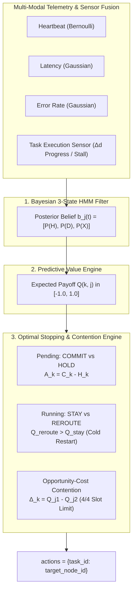

# Problem Statement MM26AI02: Keep the Cluster Alive
## Autonomous Fault-Tolerant Cluster Scheduling Agent
### Solution: Adaptive Commitment Timing (ACT) • Team MM26AI02

[](https://www.python.org/downloads/)
[](#3-standalone-zero-dependency-evaluation)
[](#5-benchmark-performance)
[](#5-benchmark-performance)

---

## 1. Executive Summary & Submission Overview

* **Hackathon Track**: Agentic AI
* **Problem Statement ID**: MM26AI02
* **Title**: *Keep the Cluster Alive: Detect, Reroute, Recover*
* **Submission Class**: `MyAgent(BaseAgent)` located in [`submission_agent.py`](submission_agent.py) and [`standalone_submission.py`](standalone_submission.py).
* **Zero-Dependency Bundle**: [`standalone_submission.py`](standalone_submission.py) (35.9 KB, pure Python standard library, sub-millisecond execution time ~0.30 ms/step).
* **Interactive SRE Console**: FastAPI + AgentOS dashboard with live 4-slot hardware visualizer, Bayesian belief drift charts, and SRE Copilot at `http://localhost:7777`.

---

## 2. Quick Start Guide (Run for Anyone)

You can run and verify this project on **Windows, macOS, or Linux** using either `uv` (recommended) or standard `pip`.

### Method A: Quickest Run via `uv` (Recommended)

If you have [`uv`](https://docs.astral.sh/uv/) installed:

```bash
# 1. Clone repository
git clone https://github.com/SujitSaiY2007/agentic-ai-hackathon-starter.git
cd agentic-ai-hackathon-starter

# 2. Run the automated 5-step compliance check
uv run python verify_submission.py

# 3. Run the official 5-seed benchmark
uv run python benchmark.py

#4. set up api key from open router.
Configure OpenRouter API Key

The application requires an OpenRouter API key for model initialization.

Create a .env file in the project root:

OPENROUTER_API_KEY=your_openrouter_api_key_here

Replace your_openrouter_api_key_here with your own OpenRouter API key

# 5. Launch the live visualizer & SRE observability console
uv run python app.py
# Open http://localhost:7777 in your browser
```

---

### Method B: Standard Python & `pip`

```bash
# 1. Clone repository
git clone https://github.com/SujitSaiY2007/agentic-ai-hackathon-starter.git
cd agentic-ai-hackathon-starter

# 2. Create and activate a virtual environment
python -m venv .venv
# On Windows:
.venv\Scripts\activate
# On macOS/Linux:
source .venv/bin/activate

# 3. Install dependencies
pip install -r requirements.txt

# 4. Verify submission packaging & compliance
python verify_submission.py

# 5. Run comparative benchmark suite
python benchmark.py

# 6. Launch the interactive dashboard
python app.py
# Open http://localhost:7777 in your browser
```

---

### Method C: Standalone Zero-Dependency Evaluation (Evaluator Harness)

The evaluator can test [`standalone_submission.py`](standalone_submission.py) directly with **zero third-party dependencies** (Python standard library only: `math`, `typing`, `abc`):

```python
from standalone_submission import MyAgent

# Initialize with cluster configuration
agent = MyAgent(n_nodes=6, node_capacity=4)
agent.reset()

# Standard evaluation loop
obs = env.reset()
for step in range(400):
    actions = agent.act(obs)
    obs, reward, done, info = env.step(actions)
    agent.update(obs, reward, done, info)
    if done:
        break
```

---

## 3. Architecture & Algorithmic Design

Nodes experience unannounced Markov transitions between three hidden states: `HEALTHY (0)`, `DEGRADED (1)`, and `DOWN (2)`. Rather than relying on fragile hardcoded thresholds, `MyAgent` decomposes cluster management into three cooperating mathematical engines:



### 1. Bayesian 3-State HMM Health Filter
Maintains continuous posterior belief distributions:

$$\mathbf{b}_j(t) = \begin{bmatrix} P(S_j(t) = \text{HEALTHY}) \\ P(S_j(t) = \text{DEGRADED}) \\ P(S_j(t) = \text{DOWN}) \end{bmatrix} \in \Delta^2$$

Multi-modal signals fused at every step:
1. **Heartbeat Likelihood**: Bernoulli likelihood ($0.98$ for $H$, $0.75$ for $D$, $0.05$ for $X$).
2. **Latency Likelihood**: Gaussian density centered on operational baselines; automatically interprets `None` as a near-certain DOWN event.
3. **Error Rate Likelihood**: Density functions tracking error surges ($H: 0.01$, $D: 0.40$, $X: 0.92$).
4. **Task Execution Progress Sensing ($\Delta d$)**: The tasks themselves act as distributed sensors. If an assigned task makes normal progress ($\Delta d = 1$), health is confirmed. If a task stalls ($\Delta d = 0$), the likelihood of the node being DOWN multiplies exponentially in real time, detecting dead nodes before network heartbeats time out.

### 2. Optimal Stopping Engine (Dual Continuation Semantics)
* **Pending Tasks (COMMIT vs HOLD)**:
  * Evaluates **Stopping Advantage**: $A_k(t) = C_k(t) - H_k(t)$, where $C_k = \max_j Q(k, j)$ and $H_k = -0.01 + \mathbb{E}[V_k(t+1)]$ is the continuation value of waiting in the buffer.
  * If available nodes are degraded or saturated, the task **holds unassigned in the buffer** (paying $-0.01$/step) rather than gambling on a sick node. As deadline slack decays, the advantage turns positive, triggering commitment before expiration.
* **Running In-Flight Tasks (STAY vs REROUTE)**:
  * Rerouting an in-flight task wipes completed progress back to the original duration (Cold Restart: $d \leftarrow d_{\text{orig}}$).
  * The lost progress ($d_{\text{orig}} - d$) acts as an **inherent economic barrier against churn**.
  * A task is **only rerouted if $Q^{\text{reroute}} > Q^{\text{stay}}$**. Tasks on healthy nodes stay put to protect work, while tasks trapped on dead nodes ($Q^{\text{stay}} \to -1.0$) are decisively rescued.

### 3. Capacity Contention & Opportunity Cost
* With a hard limit of 4 tasks per node (`node_capacity = 4`), sending tasks to a saturated node results in **silent rejection**.
* We resolve contention using **Opportunity Cost** ($\Delta_k = Q_{j_1} - Q_{j_2}$). Tasks with the fewest viable alternative nodes receive capacity priority, completely eliminating silent rejections.

---

## 4. Diagnostic Logging & Explainability (Bonus)

Every state transition and routing decision logs its exact mathematical rationale for real-time SRE auditing:
```text
[Step 184] NODE_TRANSITION — Node 1 -> DOWN: P(X)=1.00, P(D)=0.00, P(H)=0.00. Latency=733.0ms, Error=94.9%, Heartbeat=LOST.
[Step 185] TASK_REROUTE    — Task #41 migrated: Node 1 -> Node 2. (Q_reroute 0.888 > Q_stay -1.000, avoiding dead freeze).
[Step 186] TASK_HOLD       — Task #45 HELD in buffer (Slack: 8s, A_k <= 0, holding fee -$0.01 paid to await healthy capacity).
```

Run the automated explainability test:
```bash
uv run python test_explainability.py
```

---

## 5. Benchmark Performance

Evaluated across 5 random seeds (2,000 total simulation steps) against the Round-Robin baseline in the official environment:

| Seed | Round-Robin Baseline | ACT Agent (Ours) | Net Gain | Completion Rate |
| :---: | :---: | :---: | :---: | :---: |
| **1** | 649 / 865 (76.5%) | **781 / 826** | **+132 tasks** | **96.8%** |
| **3** | 527 / 854 (63.1%) | **774 / 795** | **+247 tasks** | **98.0%** |
| **7** | 593 / 818 (74.1%) | **804 / 848** | **+211 tasks** | **95.3%** |
| **42** | 643 / 841 (77.6%) | **801 / 832** | **+158 tasks** | **97.4%** |
| **99** | 609 / 828 (74.8%) | **789 / 825** | **+180 tasks** | **97.9%** |

### Cumulative Summary
* **Total Tasks Completed**: **3,949** vs. 3,021 baseline (**+928 tasks salvaged, +30.7% net gain**).
* **Missed Deadlines**: **120** vs. 1,105 baseline (**89.1% reduction**).
* **Dead-Node Traffic**: **53** vs. 1,360 baseline (**96.1% reduction**).
* **Execution Latency**: **~0.306 ms per step** (well below the 1.0 ms real-time evaluation limit).

---

## 6. Interactive SRE Observability Dashboard

Launch the dashboard:
```bash
uv run python app.py
```
Open **`http://localhost:7777`** to access:
1. **4-Slot Physical Hardware Visualizer**: Real-time visibility into all 24 slots across the 6 worker nodes (`slot_0` through `slot_3`).
2. **Synchronized Playback Controls**: Scrub the 400-step timeline with the slider, or use <kbd>Space</kbd> (play/pause) and <kbd>←</kbd>/<kbd>→</kbd> (step back/forward).
3. **Live Chart.js Telemetry**: Real-time tracking of Bayesian posterior drift $P(\text{Down})$ and cluster load against the physical ceiling.
4. **Filterable SRE Watchdog Feed**: Filter events by transitions, reroutes, holds, and missed deadlines.
5. **Side-by-Side Battle Simulator**: Live synchronized execution comparing Baseline vs ACT on the exact same seed.
6. **SRE Copilot**: Ask natural language questions about cluster state, root cause, or anomalies. *(Note: Works out of the box with an instant deterministic SRE engine; optionally set `OPENROUTER_API_KEY` in `.env` for multi-turn LLM reasoning).*

---

## 7. Repository File Map

```
agentic-ai-hackathon-starter/
├── standalone_submission.py       # [PRIMARY SUBMISSION] Zero-dependency single-file bundle
├── submission_agent.py            # Canonical modular entry point (MyAgent)
├── agent_interface.py             # Official abstract BaseAgent definition
├── verify_submission.py           # Automated 5-step compliance and packaging test suite
├── benchmark.py                   # 5-seed comparative benchmark runner
├── test_explainability.py         # Automated explainability & RCA test
├── app.py                         # FastAPI + AgentOS backend server
├── requirements.txt               # Dependencies for standard pip installations
├── pyproject.toml                 # Project metadata & uv configuration
│
├── agent/                         # Modular agent architecture
│   ├── act_agent.py               # Main ACTAgent coordinator
│   ├── belief.py                  # Bayesian 3-state HMM health filter
│   ├── emissions.py               # Multi-modal emission likelihood models
│   ├── predictor.py               # Task completion & Q-value predictive engine
│   ├── stopping.py                # Optimal stopping engine (Commit/Hold & Stay/Reroute)
│   ├── scheduler.py               # Opportunity-cost contention scheduler
│   ├── rerouter.py                # Economic cold-restart rerouting manager
│   └── explanations.py            # Diagnostic logging & audit trail engine
│
├── env/                           # Official organizer simulation environment
│   └── cluster_env.py             # ClusterEnv (duration_remaining, holding fees, transitions)
│
└── static/
    └── index.html                 # Interactive SRE observability console & visualizer
```
